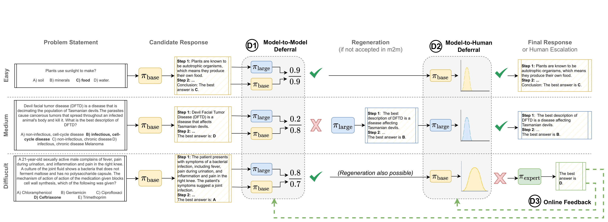

# Towards a Multi-LLM Framework for Collaborative Human-AI Decision-Making: Code
<div align="left">

</div>

## Abstract
Effective human-AI decision-making should balance three key factors: *correctness* of predictions, *cost* of knowledge and reasoning complexity of various large language models (LLMs), and *uncertainty* about whether automated answers are reliable enough or to involve a human expert. In this work, we present a multi-LLM decision framework that adaptively delegates tasks across multiple tiers of expertise -- a lightweight *base* model for initial candidate answers, a more capable and knowledgeable (but costlier) *large* model, and a *human expert* for high-risk or ambiguous cases. Our method proceeds in two stages. First, a Model-to-Model deferral policy determines whether it should accept the base model’s candidate answer or regenerate it with the large model, based on the ratio surrogate token probability. Second, a Model-to-Human deferral policy decides whether the model response is sufficiently certain or requires human intervention, based on Monte-Carlo Dropout sampling of the surrogate token probability. Moreover, we incorporate an online learning mechanism in the framework that can leverage human feedback to improve decision quality over time. We demonstrate this approach to general question-answering (ARC-Easy and ARC-Challenge) and medical question-answering (MedQA and MedMCQA). Our results show that our multi-tier strategy outperforms single-model baselines in accuracy while minimising cost and providing a principled way to handle uncertainty for human escalation.

## Getting Started

### Prerequisites
- Python 3.11
- CUDA toolkit 12.2 (for GPU support)
- 1 x A100 (80GB) GPU

### Installation

1. Clone the repository and navigate to the project directory:
```bash
git clone <repository_url>
cd <repository_name>
```

2. Create and activate a virtual environment with required dependencies:
```bash
conda env create -f environment.yaml
conda activate llms
```

### Code Structure
```
.
├── assets/                     # Project images and diagrams
├── config/                     # Experiment configuration files
    ├── ai2arc_challenge/               # Config files for ARC2-Challenge
    ├── ai2arc_easy/                    # Config files for ARC2-Challenge
    ├── medmcqa/                        # Config files for MedMCQA
    └── medqa/                          # Config files for MedQA
├── eval/                       # Evaluation notebook for uncertainty plots
├── results/                    # Saved outputs of all runs
└── src/                        # Core source code
```

### Run main file
This will run the main decision process with the `configs/debug.yaml` as configuration file.
```bash
python main.py
```

### Experiment 1: Reducing Unnecessary Regenerations
Here we explain how to run the experiments for the first part of the paper, that focuses on **desideratum 1**: ``The Model-to-Model deferral policy should escalate to the large model only if the base model’s response is likely incorrect, avoiding unnecessary computational costs.''

The deferral rates, rate of unnacessary regenarations, and rate of error correction are printed in the output once it is run.

**ARC2-Easy**:
```bash
python main.py --config-path=configs/ai2arc_easy/experiment_1 --config-name=models_1_3
python main.py --config-path=configs/ai2arc_easy/experiment_1 --config-name=models_1_8
python main.py --config-path=configs/ai2arc_easy/experiment_1 --config-name=models_3_8
```

**ARC2-Challenge**:
```bash
python main.py --config-path=configs/ai2arc_challenge/experiment_1 --config-name=models_1_3
python main.py --config-path=configs/ai2arc_challenge/experiment_1 --config-name=models_1_8
python main.py --config-path=configs/ai2arc_challenge/experiment_1 --config-name=models_3_8
```

**MedQA**:
```bash
python main.py --config-path=configs/medqa/experiment_1 --config-name=models_1_3
python main.py --config-path=configs/medqa/experiment_1 --config-name=models_1_8
python main.py --config-path=configs/medqa/experiment_1 --config-name=models_3_8
```

**MedMCQA**:
```bash
python main.py --config-path=configs/medmcqa/experiment_1 --config-name=models_1_3
python main.py --config-path=configs/medmcqa/experiment_1 --config-name=models_1_8
python main.py --config-path=configs/medmcqa/experiment_1 --config-name=models_3_8
```


### Experiment 2: Escalate to Humans When Uncertain
Here we explain how to run the experiments for the first part of the paper, that focuses on **desideratum 2**: ``The Model-to-Human deferral policy should refer to human experts only when the model’s uncertainty is too high, reducing unnecessary human intervention.''

Running the experiment 1 commands will create a `results` folder and in each folder all the CoT, predictions, uncertainties, etc are saved in `run_yyymmdd__hhmmss_{experiment_name}.csv`. We can use this output to calculate the accuracy vs escalation rate over multiple $\tau$ values, by running the provided [jupyter notebook file](./eval/uncertainty_plots.ipynb)

### Experiment 3: Online Improvement of Decision System
Here we explain how to run the experiments for the first part of the paper, that focuses on **desideratum 2**: ``The framework should continually refine its policies based on feedback, ensuring adaptive and risk-minimised decision-making.''

Running the commands below will make the parameters $\theta = \{M, \tau_{\text{base}}, \tau_{\text{large}}\}$ learnable.

**ARC2-Easy**:
```bash
python main.py --config-path=configs/ai2arc_easy/experiment_3 --config-name=models_1_3
python main.py --config-path=configs/ai2arc_easy/experiment_3 --config-name=models_1_8
python main.py --config-path=configs/ai2arc_easy/experiment_3 --config-name=models_3_8
```

**ARC2-Challenge**:
```bash
python main.py --config-path=configs/ai2arc_challenge/experiment_3 --config-name=models_1_3
python main.py --config-path=configs/ai2arc_challenge/experiment_3 --config-name=models_1_8
python main.py --config-path=configs/ai2arc_challenge/experiment_3 --config-name=models_3_8
```

**MedQA**:
```bash
python main.py --config-path=configs/medqa/experiment_3 --config-name=models_1_3
python main.py --config-path=configs/medqa/experiment_3 --config-name=models_1_8
python main.py --config-path=configs/medqa/experiment_3 --config-name=models_3_8
```

**MedMCQA**:
```bash
python main.py --config-path=configs/medmcqa/experiment_3 --config-name=models_1_3
python main.py --config-path=configs/medmcqa/experiment_3 --config-name=models_1_8
python main.py --config-path=configs/medmcqa/experiment_3 --config-name=models_3_8
```


```
python main.py --config-path=configs/ai2arc_easy --config-name=first_qwen
python main.py --config-path=configs/ai2arc_challenge --config-name=first_qwen
python main.py --config-path=configs/medqa --config-name=first_qwen
python main.py --config-path=configs/medmcqa --config-name=first_qwen
```

python main.py --config-path=configs/ai2arc_easy --config-name=first_llama_calibrated