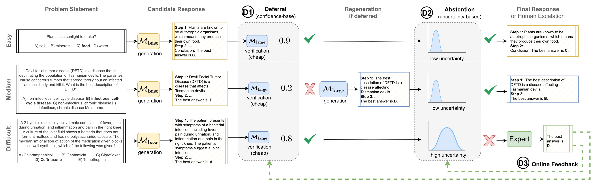

# Towards a Cascaded LLM Framework for Cost-effective Human-AI Decision-Making: Code
<div align="left">

</div>

## Abstract
Effective human-AI decision-making balances three key factors: the *correctness* of predictions, the *cost* of knowledge and reasoning complexity, and the confidence about whether to *abstain* from automated answers or involve human experts. In this work, we present a cascaded LLM decision framework that adaptively delegates tasks across multiple tiers of expertise -- a base model for initial candidate answers, a more capable and knowledgeable (but costlier) large model, and a human expert for when the model cascade abstains. Our method proceeds in two stages. First, a deferral policy determines whether to accept the base model’s answer or regenerate it with the large model based on the confidence score. Second, an abstention policy decides whether the cascade model response is sufficiently certain or requires human intervention. Moreover, we incorporate an online learning mechanism in the framework that can leverage human feedback to improve decision quality over time. We demonstrate this approach to general question-answering (ARC-Easy and ARC-Challenge) and medical question-answering (MedQA and MedMCQA). Our results demonstrate that our cascaded strategy outperforms single-model baselines in most cases, achieving higher accuracy while reducing costs and providing a principled approach to handling abstentions.

## Getting Started

### Prerequisites
- Python 3.11
- CUDA toolkit 12.2 (for GPU support)
- 1 x A100 (80GB) GPU

### Installation

1. Clone the repository and navigate to the project directory:
```bash
git clone <repository_url>
cd <repository_name>
```

2. Create and activate a virtual environment with required dependencies:
```bash
conda env create -f environment.yaml
conda activate llms
```

### Code Structure
```
.
├── assets/                     # Project images and diagrams
├── precomputed_responses/      # Experiment configuration files and precomputed responses of the
├── eval/                       # Evaluation notebook for imperfect expert plots
└── src/                        # Core source code
```


### Experiment 1: Deferral Strategies
Run the commands below for the chosen dataset (`arc_easy`, `arc_challenge`, `medqa`, `medmcqa`, or `mmlu`), substituting the model configuration (`llama_1_8`, `llama_3_8`, `qwen_1_7`, `qwen_3_7`) as desired, and the calibration (`calibrated` or `uncalibrated`):

```bash
python main.py --config-path=precomputed_responses/<model_config>/<calibration>/<dataset>
```

Example usages:

```bash
# Example for ARC2-Easy
python main.py --config-path=precomputed_responses/llama_1_8/calibrated/arc_easy
```


### Experiment 2: Online Improvement of Decision System
Run the commands below for the chosen dataset (`arc_easy`, `arc_challenge`, `medqa`, `medmcqa`, or `mmlu`), substituting the model configuration (`llama_1_8`, `llama_3_8`, `qwen_1_7`, `qwen_3_7`) as desired.


```bash
python main.py --config-path=precomputed_responses/<model_config>/online/<dataset>
```

Example usages:

```bash
# Example for ARC2-Easy
python main.py --config-path=precomputed_responses/llama_1_8/online/arc_easy
```

### Citation
```bash
@inproceedings{Fanconi2025Towards,
  title={Towards a Cascaded LLM Framework for Cost-effective Human-AI Decision-Making},
  author={Fanconi, Claudio and van der Schaar, Mihaela},
  booktitle={39th Conference on Neural Information Processing Systems},
  year={2025}
}
```